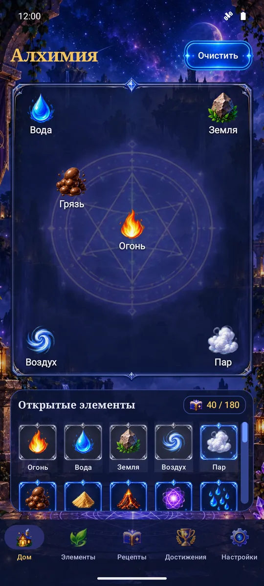
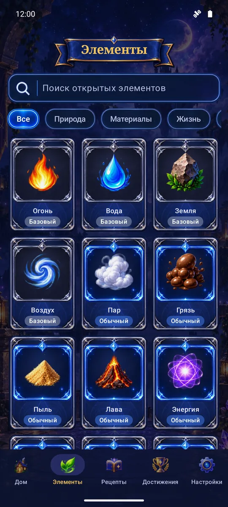
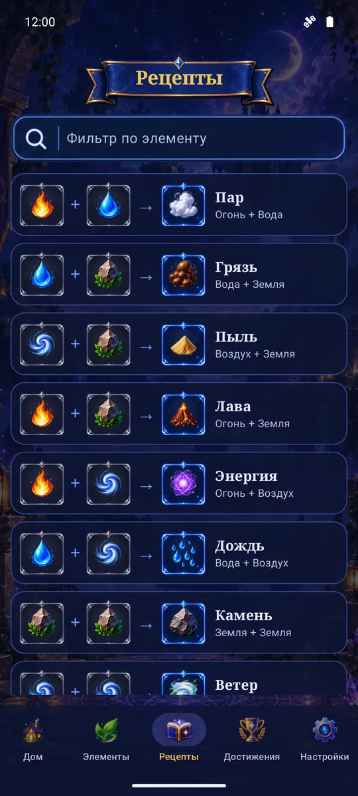
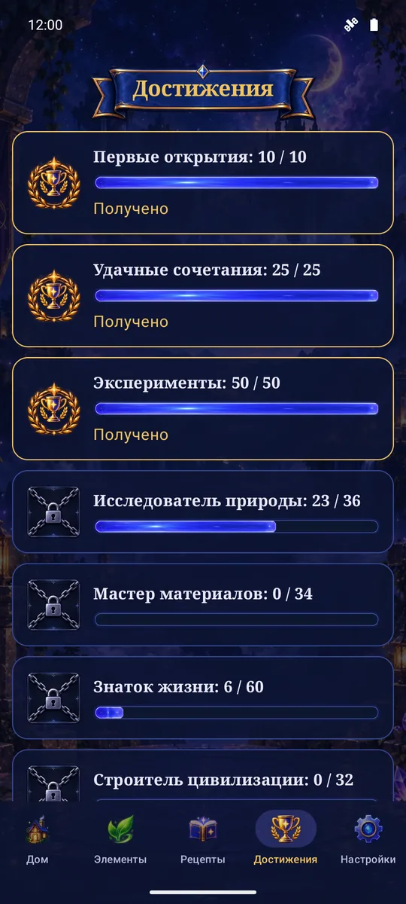
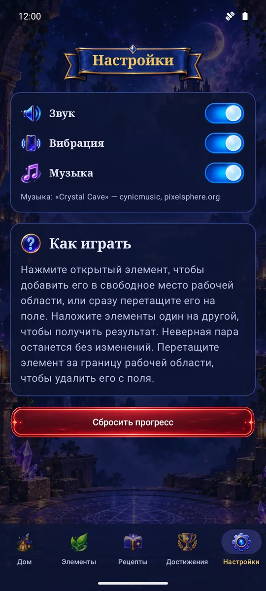

# Алхимия

Уютная оффлайн-игра о смешивании элементов для Android. Начните с огня, воды, земли и воздуха и откройте все 180 элементов: от пара и глины до философского камня.

<p align="center">
  
  
  
  
  
</p>

## Что в игре

- 180 элементов и 176 рецептов; у каждого элемента своя иллюстрация и редкость — от базовой до легендарной.
- Рабочая область: перетаскивайте элементы, накладывайте один на другой и смотрите, что получится.
- Каталог с силуэтами ещё не открытых элементов, книга найденных рецептов и достижения.
- Интересный факт о каждом элементе — из науки, истории и мифологии.
- Звуки, вибрация и спокойная фоновая музыка — каждое отключается в настройках.
- Без сети, аккаунтов, рекламы, покупок и аналитики. Прогресс хранится на устройстве, своего сервера у игры нет; если на телефоне включено резервное копирование Android, система сохранит прогресс вместе с данными других приложений и вернёт его после переустановки. Его также можно сохранить в файл в настройках.

## Установка

Нужен Android 12 или новее.

1. Скачайте `alchemy-<версия>.apk` со страницы [Releases](../../releases).
2. Откройте файл на телефоне. Если система спросит, разрешите установку из этого источника.

Обновления ставятся поверх, прогресс сохраняется.

## Сборка

Нужны JDK 17 и Android SDK (compileSdk 36).

```bash
./gradlew installDebug        # отладочная сборка на подключённое устройство
./gradlew qualityCheck testDebugUnitTest assembleDebug   # проверки
```

Инструментальные тесты и остальные команды описаны в [docs/testing.md](docs/testing.md).

Релизная сборка подписывается ключом, который в репозиторий не входит. Его путь и пароли берутся из `~/.gradle/gradle.properties`:

```properties
ALCHEMY_RELEASE_STORE_FILE=/путь/к/keystore.jks
ALCHEMY_RELEASE_STORE_PASSWORD=...
ALCHEMY_RELEASE_KEY_ALIAS=...
ALCHEMY_RELEASE_KEY_PASSWORD=...
```

После этого `./gradlew assembleRelease` соберёт подписанный APK в `app/build/outputs/apk/release/`. Без этих свойств релиз соберётся неподписанным.

Проект написан на Kotlin и Jetpack Compose без игровых движков и сторонних библиотек, кроме AndroidX. Графика и звуки лежат в `assets/` и перегоняются в ресурсы скриптами из `tools/` (см. [ART_ASSETS.md](ART_ASSETS.md)).

## Лицензия и авторы

Код и графика распространяются под лицензией [MIT](LICENSE).

- Графика (иллюстрации элементов, фоны, интерфейс) сгенерирована с помощью ChatGPT.
- Звуковые эффекты и музыка сгенерированы моделью Stable Audio 3 (Stability AI); один эффект — от [Kenney](https://kenney.nl), CC0; пять эффектов синтезированы скриптом `tools/build_procedural_audio.py`.

Подробности о звуках — в [assets/audio/README.md](assets/audio/README.md).
